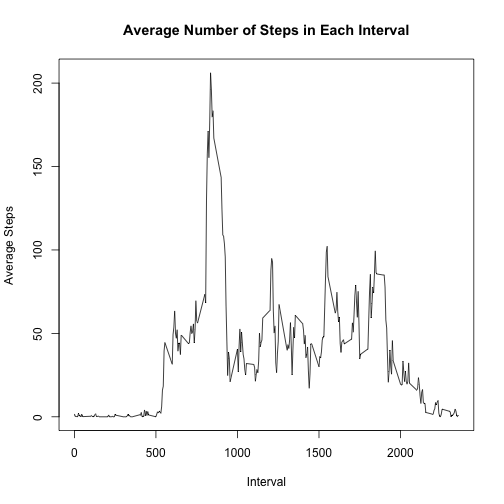
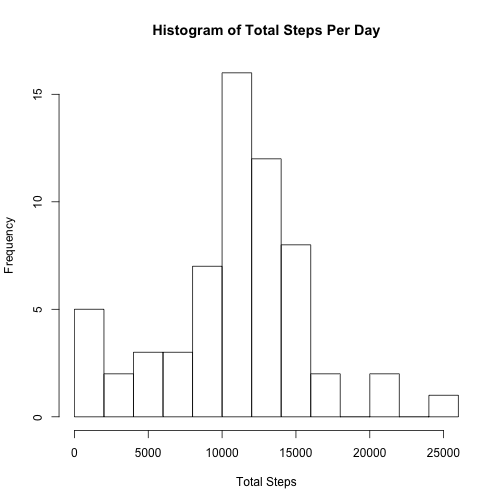
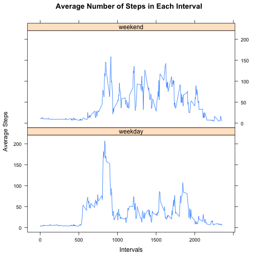

Load the data by 'readr' package

```r
library(tidyverse)
activity_monitor <- read_csv("./activity.csv", show_col_types = FALSE)
```

## What is mean total number of steps taken per day?

Calculate the total number of steps taken per day

```r
total_steps <- aggregate(steps ~ date, activity_monitor, sum)
```

Make a histogram of the total number of steps taken each day

```r
hist(total_steps$steps, xlab = "Total Steps", main = "Histogram of Total Steps Per Day",
     breaks = 10)
```


Caculate and report the mean and median of the total number of steps taken per day

```r
mean_steps <- floor(mean(total_steps$steps))
median_steps <- median(total_steps$steps)
```
The mean and median of the total number of steps taken per day are 1.0766 &times; 10<sup>4</sup> and 1.0765 &times; 10<sup>4</sup>. 

## What is the average activity pattern? 

Make a time series plot of the 5-minute interval and the average number of steps taken, averaged across all days. 

```r
mean_intervals <- activity_monitor %>% group_by(interval) %>% 
    summarise(average = mean(steps, na.rm = TRUE))
plot(mean_intervals$interval, mean_intervals$average, type = "l",
     xlab = "Interval", ylab = "Average Steps",)
title(main = "Average Number of Steps in Each Interval")
```




```r
max_interval = mean_intervals$interval[which.max(mean_intervals$average)]
```

The interval 835, on average across all the days in the dataset, contains the maximum number o steps.

## Imputing missing values 


```r
num_na <- sum(is.na(activity_monitor$steps))
```
The total number of missing values in the dataset is 2304. 

Fill in the missing values in the dataset by the mean for that 5-minute interval. 

```r
na_activity <- activity_monitor %>% filter(is.na(steps)) %>% 
    merge(mean_intervals, by = "interval") %>% mutate(steps = floor(average)) %>%
    relocate(interval, .before = average) %>% select(1:3)
```
Create a new dataset that is equal to the origianl dataset but with the missing data filled in

```r
activity_monitor$steps <- replace(activity_monitor$steps, is.na(activity_monitor$steps), na_activity$steps)
```
Make a histogram of the total number of steps taken each day

```r
total_steps1 <- activity_monitor %>% group_by(date) %>% summarise(total.steps = sum(steps))
hist(total_steps1$total.steps, xlab = "Total Steps", main = "Histogram of Total Steps Per Day", 
     breaks = 10)
```




```r
mean_steps1 <- floor(mean(total_steps1$total.steps))
median_steps1 <- median(total_steps1$total.steps)
```
The mean and median total number of steps taken per day for new dataset is 1.0749 &times; 10<sup>4</sup> and 1.1015 &times; 10<sup>4</sup>. So the mean is the same which is not surprising since I impute the missing value by the mean of that interval while the median is larger than the previous calculation. 

## Are there differences in activity patters between weekdays and weekends?

Create a new factor variable in the dataset with two levels - "weekday" and "weekend"

```r
weekends <- c("Saturday", "Sunday")
activity_monitor <- activity_monitor %>% mutate(weekday = weekdays(date), 
                                                weekend = factor(if_else(weekday 
                                                                         %in% weekends, "weekend", "weekday"))) 
str(activity_monitor)
```

```
## tibble [17,568 × 5] (S3: tbl_df/tbl/data.frame)
##  $ steps   : num [1:17568] 1 1 1 1 1 1 1 1 0 0 ...
##  $ date    : Date[1:17568], format: "2012-10-01" "2012-10-01" "2012-10-01" ...
##  $ interval: num [1:17568] 0 5 10 15 20 25 30 35 40 45 ...
##  $ weekday : chr [1:17568] "Monday" "Monday" "Monday" "Monday" ...
##  $ weekend : Factor w/ 2 levels "weekday","weekend": 1 1 1 1 1 1 1 1 1 1 ...
```


```r
mean_intervals1 <- activity_monitor %>% group_by(weekend, interval) %>% summarise(average = mean(steps))
```

```
## `summarise()` has grouped output by 'weekend'. You can override using the `.groups` argument.
```

```r
library(lattice)
xyplot(average ~ interval | weekend, data = mean_intervals1, type = "l", layout = c(1, 2),
       main = "Average Number of Steps in Each Interval", xlab = "Intervals", ylab = "Average Steps")
```



